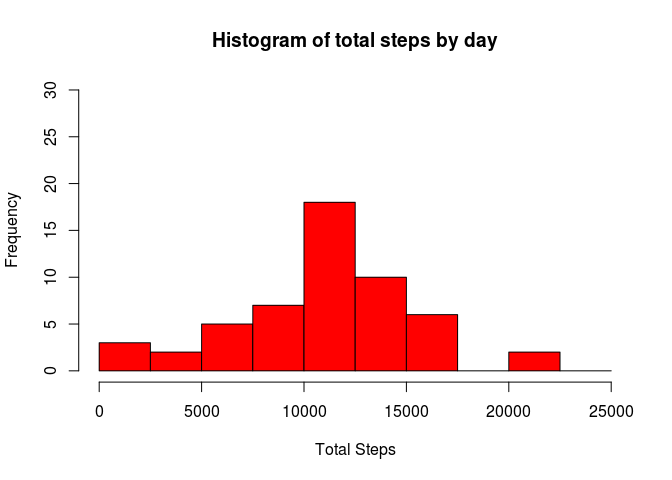
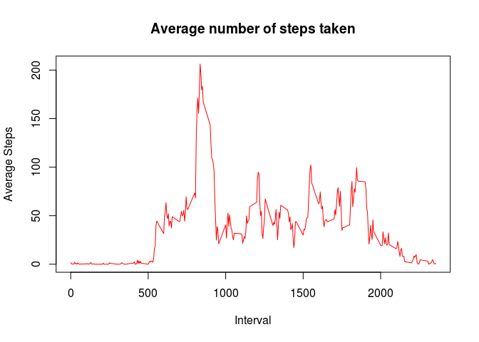

# Reproducible Research: Peer Assessment 1


```r
library(knitr)
```


## Loading and preprocessing the data


```r
myDataf <- read.csv(unz("./activity.zip", "activity.csv"), header = TRUE,
                    colClasses = c("integer", "Date", "numeric"), sep = ",",
                    na.strings = "NA", quote = "\"")
```

## What is mean total number of steps taken per day?

Histogram of the total number of steps taken each day


```r
myDataf.steps <- aggregate(steps ~ date, myDataf, sum)
kable(head(myDataf.steps))
```


date          steps
-----------  ------
2012-10-02      126
2012-10-03    11352
2012-10-04    12116
2012-10-05    13294
2012-10-06    15420
2012-10-07    11015

```r
with(myDataf.steps, plot(myDataf.steps$date,myDataf.steps$steps, type="h",
                    xlab = "Date", ylab ="Steps",
                    col="red"))
```

<!-- -->

Mean and median number of steps taken each day

```r
mean(myDataf.steps$steps, na.rm = TRUE)
```

```
## [1] 10766.19
```

```r
median(myDataf.steps$steps, na.rm = TRUE)
```

```
## [1] 10765
```

## What is the average daily activity pattern?

Time series plot of the average number of steps taken

```r
steps.average <- aggregate(steps ~ interval, myDataf, mean)
with(steps.average, 
                    plot(steps.average$interval,steps.average$steps, type = "l",
                    xlab = "Interval", ylab = "Average Steps", col = "red"))
```

<!-- -->

The 5-minute interval that, on average, contains the maximum number of steps

```r
steps.average[which.max(steps.average$steps),]
```

```
##     interval    steps
## 104      835 206.1698
```


## Imputing missing values

### Code to describe and show a strategy for imputing missing data  
1. Calculate total number of missing values in the dataset 

```r
NAs <- is.na(myDataf$steps)
sum(NAs)
```

```
## [1] 2304
```

2. Strategy for filling in all of the missing values in the dataset:  
We will fill in all missing NAs with the average number of steps in the same 5-min interval

3. New Dataset with missing data filled


```r
myDataf.filled <- myDataf                   #new data frame
myDataf.filled$id <- 1:nrow(myDataf.filled) #creates id column. will help order later
newNA <- merge(myDataf.filled[NAs,], steps.average, by="interval", sort = F) #add means 2 NAs
newNA <-  newNA[order(newNA$id), ]          #re-order
myDataf.filled$steps[NAs] <- newNA$steps.y  #filled data frame
myDataf.filled$id <- NULL                   #drops id column
kable(head(myDataf.filled))                 #shows new data
```

     steps  date          interval
----------  -----------  ---------
 1.7169811  2012-10-01           0
 0.3396226  2012-10-01           5
 0.1320755  2012-10-01          10
 0.1509434  2012-10-01          15
 0.0754717  2012-10-01          20
 2.0943396  2012-10-01          25

4. Histogram of the total number of steps taken each day after missing values are imputed


## Are there differences in activity patterns between weekdays and weekends?
