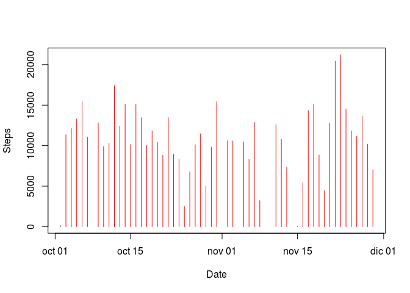
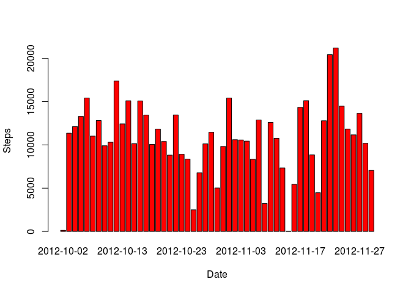

# Reproducible Research: Peer Assessment 1


## Loading and preprocessing the data


```r
myDataf <- read.csv(unz("./activity.zip", "activity.csv"), header = TRUE,
                    colClasses = c("integer", "Date", "numeric"), sep = ",",
                    na.strings = "NA", quote = "\"")
```


## What is mean total number of steps taken per day?


```r
myDataf.steps <- aggregate(steps ~ date, myDataf, sum)
with(myDataf.steps, plot(myDataf.steps$date,myDataf.steps$steps, xlab = "Date", ylab = "Steps", col="red", type="h"))
```

<!-- -->

```r
with(myDataf.steps, barplot(myDataf.steps$steps, names.arg=myDataf.steps$date, xlab = "Date", ylab = "Steps", col="red"))
```

<!-- -->


## What is the average daily activity pattern?


## Imputing missing values


## Are there differences in activity patterns between weekdays and weekends?
